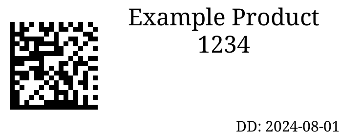

# Brother QL Grocy Label Printer Service



This project is intended to be a webhook target for [Grocy](https://github.com/grocy/grocy) to print labels to a brother QL label printer. Datamatrix barcodes are used instead of QR or linear barcodes, this matches what Grocy uses by default.

Only die-cut labels are supported as I don't have any endless rolls to test with.

## Connecting Grocy

Once you have this running somewhere update your config at `app/data/config.php` to match the following. Presuming that you have this running on localhost at port 8000.

```
    // Label printer settings
    Setting('LABEL_PRINTER_WEBHOOK', 'http://127.0.0.1:8000');
    Setting('LABEL_PRINTER_RUN_SERVER', true); 
    Setting('LABEL_PRINTER_PARAMS', []);
    Setting('LABEL_PRINTER_HOOK_JSON', false);

    Setting('FEATURE_FLAG_LABEL_PRINTER', true);

```

## Environment Variables

The label size and printer are configured via environmental variables. You can also create a `.env` file instead.

| Variable | Default | Description |
| -------- | ------- | ----------- |
| LABEL_SIZE | 62x29 | See the [brother_ql](https://github.com/pklaus/brother_ql) readme for the names of the labels |
| PRINTER_MODEL | QL-500 | The printer model, ie `QL-500`. One of the values accepted by brother_ql |
| PRINTER_PATH | file:///dev/usb/lp1 | Where the printer is found on the system. For network printers use `tcp://printer.address` |
| NAME_FONT | NotoSerif-Regular.ttf | The file name of the font in the fonts directory |
| NAME_FONT_SIZE | 48 | The size of that font |
| NAME_MAX_LINES | 4 | The maximum number of lines to use for the name |
| DUE_DATE_FONT | NotoSerif-Regular.ttf | NotoSerif-Regular.ttf | The file name of the font in the fonts directory |
| DUE_DATE_FONT_SIZE | 30 | The size of that font |

Included fonts are `NotoSans-Regular.ttf` and `NotoSerif-Regular.ttf`

## Running

**Note:** Theres no security on this web service, so don't make it publicly available.

This has been tested with python 3.10, newer may work fine.

You will need to install the `libdmtx` library for the barcodes to generate, see [pylibdmtx](https://pypi.org/project/pylibdmtx/) documentation on pypi.

Its advisable to run and install in a venv. For example:

```
    python -m venv .venv
    source ./.venv/bin/activate
```

## TODO

- Endless Labels
- Some more formatting options

### Docker

A Dockerfile is included based on a python 3.10 alpine image. The default port is 8000.

Published to Dockerhub as [sam159/brotherql_grocylabels](https://hub.docker.com/r/sam159/brotherql_grocylabels)

## Contributing

I'll try to keep on top of bugs but feature requests may go unfulfilled. Please use the issue tracking in Github.

PRs welcome!